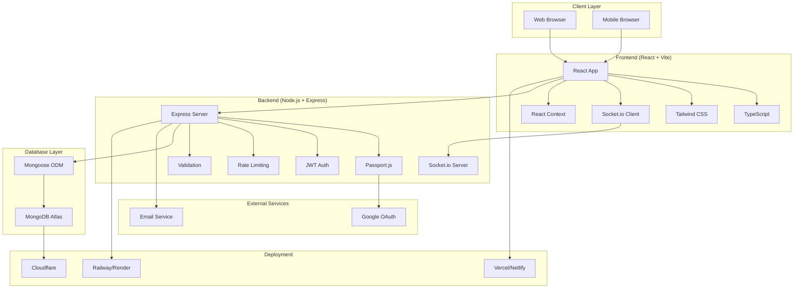
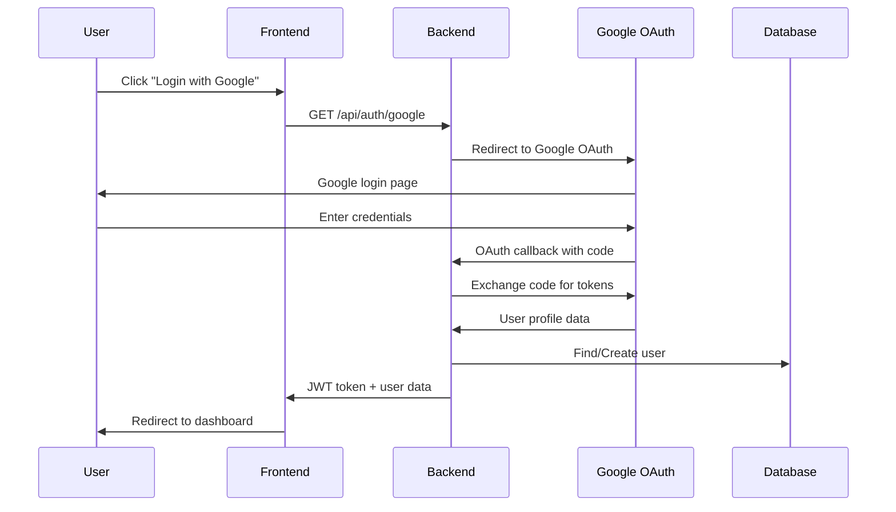
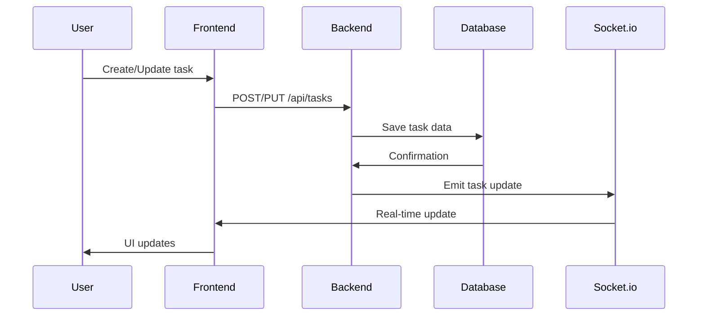

# 🏗️ System Architecture

## Overview

The Todo Task Management application follows a modern, scalable architecture with clear separation of concerns, real-time capabilities, and cloud-native deployment.

## Architecture Diagram



## Component Architecture

### Frontend Architecture

```
frontend/
├── src/
│   ├── components/          # Reusable UI components
│   │   ├── auth/           # Authentication components
│   │   ├── tasks/          # Task-related components
│   │   └── ui/             # Generic UI components
│   ├── contexts/           # React Context providers
│   │   ├── AuthContext.tsx # Authentication state
│   │   ├── SocketContext.tsx # WebSocket connection
│   │   └── ThemeContext.tsx # Theme management
│   ├── pages/              # Page components
│   │   ├── auth/           # Authentication pages
│   │   ├── Dashboard.tsx   # Main dashboard
│   │   └── Profile.tsx     # User profile
│   ├── lib/                # Utilities and API
│   │   └── api.ts          # API client
│   ├── types/              # TypeScript definitions
│   └── main.tsx            # App entry point
```

### Backend Architecture

```
backend/
├── src/
│   ├── config/             # Configuration files
│   │   └── passport.js     # OAuth configuration
│   ├── middleware/         # Express middleware
│   │   ├── auth.js         # Authentication middleware
│   │   └── validation.js   # Input validation
│   ├── models/             # Database models
│   │   ├── User.js         # User model
│   │   └── Task.js         # Task model
│   ├── routes/             # API routes
│   │   ├── auth.js         # Authentication routes
│   │   ├── tasks.js        # Task management routes
│   │   └── users.js        # User management routes
│   ├── socket/             # WebSocket handlers
│   │   └── socketHandlers.js # Real-time event handlers
│   └── server.js           # Main server file
```

## Data Flow

### Authentication Flow



### Task Management Flow



## Security Architecture

### Authentication & Authorization

1. **OAuth 2.0 Flow**: Google OAuth for secure authentication
2. **JWT Tokens**: Stateless session management
3. **Token Refresh**: Automatic token renewal
4. **Permission System**: Role-based access control

### Data Protection

1. **Input Validation**: Server-side validation using express-validator
2. **SQL Injection Prevention**: MongoDB with Mongoose ODM
3. **XSS Protection**: Content sanitization and CSP headers
4. **Rate Limiting**: API protection against abuse
5. **CORS Configuration**: Secure cross-origin requests

### Environment Security

1. **Environment Variables**: Sensitive data stored in .env files
2. **Production Secrets**: Secure secret management
3. **HTTPS Only**: All production traffic encrypted
4. **Security Headers**: Helmet.js for security headers

## Performance Architecture

### Frontend Optimization

1. **Code Splitting**: Lazy loading of components
2. **Bundle Optimization**: Vite for fast builds
3. **Caching**: Browser caching strategies
4. **Image Optimization**: Compressed and optimized images

### Backend Optimization

1. **Database Indexing**: Optimized MongoDB queries
2. **Pagination**: Efficient data loading
3. **Caching**: Redis for session storage (future)
4. **Compression**: Gzip compression for responses

### Real-time Performance

1. **WebSocket Connection**: Efficient real-time updates
2. **Event Broadcasting**: Selective event emission
3. **Connection Management**: Proper socket cleanup
4. **Error Handling**: Graceful degradation

## Scalability Considerations

### Horizontal Scaling

1. **Stateless Backend**: JWT-based authentication
2. **Database Sharding**: MongoDB Atlas cluster
3. **Load Balancing**: Multiple server instances
4. **CDN**: Static asset distribution

### Vertical Scaling

1. **Memory Optimization**: Efficient data structures
2. **CPU Optimization**: Async/await patterns
3. **Database Optimization**: Indexed queries
4. **Connection Pooling**: Database connection management

## Monitoring & Logging

### Application Monitoring

1. **Error Tracking**: Centralized error logging
2. **Performance Metrics**: Response time monitoring
3. **User Analytics**: Usage pattern tracking
4. **Health Checks**: API endpoint monitoring

### Infrastructure Monitoring

1. **Server Metrics**: CPU, memory, disk usage
2. **Database Metrics**: Query performance
3. **Network Metrics**: Latency and throughput
4. **Security Monitoring**: Failed authentication attempts

## Deployment Architecture

### Development Environment

```
Local Development:
├── Frontend: http://localhost:3000
├── Backend: http://localhost:5000
├── Database: MongoDB Atlas (cloud)
└── OAuth: Google OAuth (development credentials)
```

### Production Environment

```
Production Deployment:
├── Frontend: Vercel/Netlify (CDN)
├── Backend: Railway/Render (auto-scaling)
├── Database: MongoDB Atlas (managed)
├── OAuth: Google OAuth (production credentials)
└── Monitoring: Built-in platform monitoring
```

## Disaster Recovery

### Backup Strategy

1. **Database Backups**: MongoDB Atlas automated backups
2. **Code Backups**: GitHub repository
3. **Configuration Backups**: Environment variable documentation
4. **Recovery Procedures**: Documented recovery steps

### High Availability

1. **Multi-Region Deployment**: Cloud provider redundancy
2. **Database Replication**: MongoDB Atlas replica sets
3. **Load Balancing**: Automatic failover
4. **Health Monitoring**: Continuous health checks

## Future Architecture Enhancements

### Planned Improvements

1. **Microservices**: Break down into smaller services
2. **Event Sourcing**: CQRS pattern implementation
3. **GraphQL**: More efficient data fetching
4. **Service Mesh**: Istio for service communication
5. **Kubernetes**: Container orchestration
6. **Serverless**: AWS Lambda functions

### Technology Upgrades

1. **React 18**: Concurrent features
2. **Node.js 20**: Latest LTS features
3. **MongoDB 7**: Latest database features
4. **TypeScript 5**: Enhanced type safety
5. **WebAssembly**: Performance-critical components

---

This architecture provides a solid foundation for a scalable, maintainable, and secure task management application. 